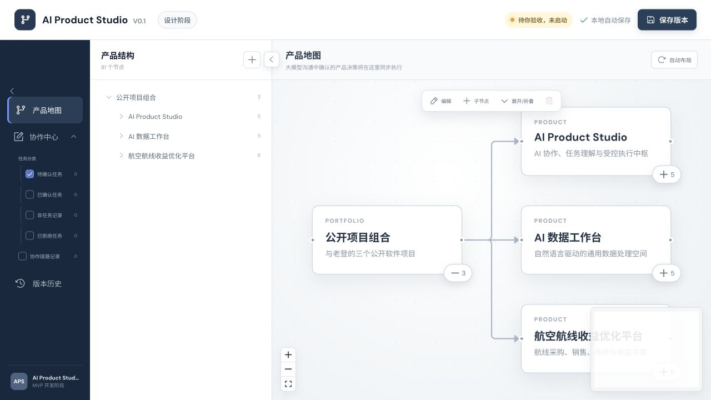

# AI Product Studio

一个受控的 AI 协作与任务执行原型。它把对话中的任务理解、项目归属、人工确认、Codex 执行、测试结果和回传状态组织在同一条可追踪链路中。



## 核心原则

- 用户是唯一授权来源
- 非任务、规则讨论和系统测试不会自动生成执行任务
- 草案必须由用户确认后才能派发
- 任务只能进入已注册项目和允许的执行范围
- 失败记录保留，重试产生新的执行记录
- 会话地址、窗口位置和运行历史不会随源码公开

## 本地运行

```bash
npm install
npm run build
APS_HOST=127.0.0.5 APS_PORT=8005 node server.mjs
```

打开 `http://127.0.0.5:8005/`。

首次使用时需在页面中配置自己的 ChatGPT 会话和精确窗口位置。不要把 Cookie、Token 或浏览器登录态写入仓库。

## 验证

```bash
npm run typecheck
node scripts/test-aps005.mjs
node scripts/test-aps006.mjs
node scripts/test-aps008.mjs
node scripts/test-controlled-development.mjs
node scripts/test-read-only-inspection.mjs
node scripts/test-collaboration-target.mjs
node scripts/test-writeback.mjs
```

测试脚本使用 `/private/tmp` 隔离运行时和示例工作区，不应写入正式项目数据。

## 公开版边界

- 产品地图只展示本次公开的三个项目。
- 仓库不包含真实会话 URL、任务历史、执行记录、checkpoint 和本机绝对路径。
- 定时自动监听不在公开版范围内，协作必须由用户手动启动。
- Claude 和 Gemini 仅显示为尚未接入，不宣称可用。

## 许可

当前仓库用于公开展示和学习参考，暂未附加开源许可证。
